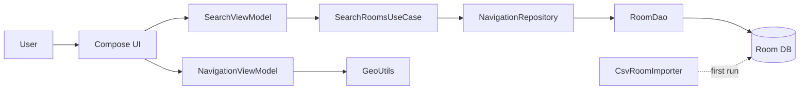

# TopperNav Architecture (Final Sprint)

Purpose: brief, academic description of the current code layout and data flow. Neutral tone.

## Components
- UI (Jetpack Compose): Search, Navigate, History, Settings
- ViewModel: 
  - SearchViewModel manages query, results, and loading state
  - NavigationViewModel holds permission, location, destination, ETA, and debug status
- Domain: SearchRoomsUseCase (validation + orchestration)
- Data
  - Repository interface + Room-backed implementation (NavigationRepositoryImpl)
  - Room database (TopperNavDatabase)
  - RoomDao for queries
  - CsvRoomImporter (one-shot DB seeding)
  - Entities: RoomEntity
- Utility: GeoUtils (distance, bearing, cardinal)
- Config: AppConfig (singleton toggles and constants)

## Component diagram (Mermaid)

Notes:
- CSV importer runs once on app startup (background thread) if the DB is empty.
- Navigate computes straight‑line distance, bearing, and ETA. No step‑by‑step routing is implemented in this project.

## Data flow (search)
1. User types in Search.
2. SearchViewModel invokes SearchRoomsUseCase.
3. Use case validates input; calls repository.
4. Repository queries RoomDao with a LIKE pattern (building, room, or both).
5. Results map to strings like `BUILDING ROOM` for UI display.

## Data flow (navigate)
1. User selects a result (e.g., `SNELL HALL B104`).
2. MainActivity parses to (building, room) and looks up coordinates in Room DB.
3. NavigationViewModel receives destination and location permission.
4. NavigationViewModel computes distance, bearing, ETA via GeoUtils and exposes NavState.
5. Navigate screen renders name, arrow, status line, and a small debug panel.

## Threading
- CSV import: Dispatchers.IO launched from MainActivity.
- Search: Dispatchers.IO inside SearchViewModel.
- Location updates: delivered via callbackFlow and processed on ViewModel scope.

## Non‑functional quality notes
- Local only: all data on device (Room DB seeded from bundled CSV). No network calls.
- Security (treated as non‑functional):
  - App‑private Room DB; no PII in CSV.
  - Basic input validation for search and CSV rows.
  - Minimal logging (CSV/SEARCH/NAV/Perf); no sensitive data in logs.
- Performance: calculations are O(1); search latency logged (Perf). ETA math uses AppConfig.walkingSpeedMps.

## UML mapping to source (implemented)
- Singleton: `core/AppConfig.kt` (feature flags, walking speed, optional mock location)
- State: `NavigationViewModel.NavState` + `StateFlow<NavState>` drive UI
- Use Case: `domain/usecase/SearchRoomsUseCase.kt` coordinates repository access
- Repository/Facade: `data/repository/NavigationRepositoryImpl.kt` mediates UI/domain and Room DB
- Sequence: 
  - Search: UI → SearchViewModel → SearchRoomsUseCase → NavigationRepository → RoomDao
  - Navigate: UI → NavigationViewModel → LocationManager/GeoUtils
- Component: layers shown above; deployment is single Android device

## Debugging aid added (final sprint)
- `NavigationViewModel.recompute()` logs: `NAV Recomputed d=…m b=…° eta=…m`
- Navigate screen debug panel shows permission, user/dest coords, and quick links to system Location/App settings.
